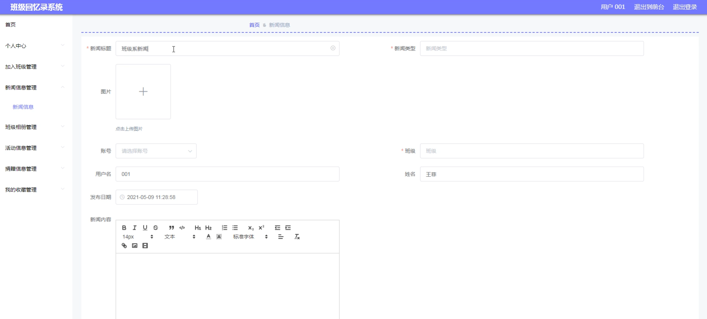

# 基于java的海滨学院班级回忆录的设计与实现

---
### 👉作者QQ ：1556708905 微信：zheng0123Long (支持定制修改、部署调试、定制毕设)

### 👉接网站建设、小程序、H5、APP、各种系统等

---

#### 介绍

海滨学院班级回忆录系统旨在为学院的师生提供一个记录和回忆班级美好时光的平台，通过数字化的方式保存珍贵的班级记忆，增强班级成员之间的情感联系和归属感。该系统基于 Java 技术开发，具有稳定、高效和可扩展的特点，能够满足不同用户的需求。
#### 技术栈

后端技术栈：Springboot+Mysql+Maven

前端技术栈：Vue+Html+Css+Javascript+ElementUI

开发工具：Idea+Vscode+Navicate

#### 系统功能介绍

（一）管理端  
个人中心：管理端人员可以查看和修改个人资料，设置工作偏好和通知方式。  
用户管理：对系统中的所有用户进行信息审核、权限设置、账号管理等操作，确保用户信息的准确性和安全性。  
班委管理：负责班委的任命、职责分配、工作监督和考核评估。  
班级信息管理：全面管理班级的基本信息，包括班级名称、成立时间、专业方向、历任班主任等。  
加入班级管理：审批用户加入班级的申请，维护班级成员的名单和权限。  
新闻信息管理：审核和发布与班级相关的新闻动态，如班级荣誉、重大活动报道等。  
班级相册管理：整理和审核上传的班级照片，对相册进行分类和编辑，确保图片内容的合规性和质量。  
活动信息管理：策划和记录班级的各类活动，包括活动主题、时间、地点、参与人员等。  
捐赠信息管理：管理班级成员的捐赠记录和相关信息，公示捐赠用途和使用情况。  
论坛管理：监督论坛的交流内容，处理违规言论，引导积极健康的讨论氛围。  
系统管理：负责系统的整体配置、数据备份与恢复、性能优化以及安全防护等工作。  

（二）班委端  
班级信息：查看和编辑所在班级的详细信息，确保信息的及时更新和准确性。  
新闻信息：收集和发布班级内的新闻资讯，展示班级的最新动态和成就。  
班级相册：组织和上传班级活动的照片，与同学们共同分享美好瞬间。  
活动信息：协助策划和组织班级活动，记录活动的全过程和反馈。  
捐赠信息：发起和管理班级内部的捐赠活动，统计捐赠情况并向同学们公示。  
论坛：参与论坛的讨论，解答同学们的问题，促进班级内部的交流与互动。  
个人中心：修改个人信息，查看自己的工作记录和班级贡献。  
后台管理  
班级信息管理：对班级信息进行细化和补充，以更全面地展示班级特色。  
加入班级管理：处理同学们的入班申请，维护班级成员的稳定和团结。  
新闻信息管理：筛选和编辑有价值的新闻内容，提升新闻质量和可读性。  
班级相册管理：对相册进行分类整理，优化图片展示效果。  
活动信息管理：总结活动经验，为未来的活动策划提供参考。  
捐赠信息管理：确保捐赠流程的透明和公正，增强同学们的信任。  

（三）用户端  
班级信息：浏览所在班级的基本情况和发展历程，增进对班级的了解。  
新闻信息：及时获取班级的最新新闻和重要通知，保持信息畅通。  
班级相册：查看班级相册中的照片，回忆美好时光。  
活动信息：了解班级举办的各类活动，报名参与感兴趣的活动。  
捐赠信息：关注班级的捐赠情况，积极参与捐赠活动，为班级发展贡献力量。  
论坛：在论坛中与同学们交流互动，分享学习、生活中的点滴。  
个人中心：完善个人资料，设置个性化的页面展示。  
后台管理  
加入班级管理：提交加入班级的申请，等待审批。  
新闻信息管理：提供新闻线索或建议，参与班级新闻的共建。  
班级相册管理：上传自己拍摄的班级照片，丰富相册内容。  
活动信息管理：反馈活动参与感受，协助改进活动策划。  
捐赠信息管理：查看自己的捐赠记录和班级捐赠的整体情况。  
我的收藏管理：收藏感兴趣的班级信息、新闻、照片等内容，方便随时回顾。  

#### 系统作用

留存珍贵回忆  
系统以数字化的形式全面、细致地保存了班级的各类信息，包括照片、新闻、活动记录等，为班级成员留下了永恒的回忆。  
增强班级凝聚力  
提供了一个交流互动的平台，让班级成员能够分享彼此的经历和感受，增进了解和信任，从而增强班级的凝聚力和向心力。  
促进信息共享  
及时发布班级的新闻动态、活动信息和捐赠情况，确保每位成员都能获取到最新、最准确的信息，避免信息不对称。  
传承班级文化  
记录班级的发展历程和特色文化，为后续的班级成员提供了学习和借鉴的素材，有助于传承和发扬优秀的班级文化。  
方便管理与组织  
为管理端和班委端提供了便捷的管理工具，能够高效地组织活动、管理班级事务，提高班级管理的效率和质量。  

#### 系统功能截图

代码结构

数据库表

登录

前台页面首页

班委管理

班级相册管理

班委端后台管理

班级信息管理

用户端新闻信息管理

活动信息管理

捐赠信息管理

个人中心

论坛

#### 总结

海滨学院班级回忆录系统通过丰富的功能模块和明确的角色分工，为学院的班级管理和成员交流创造了良好的条件。它不仅是一个存储回忆的平台，更是连接班级成员情感的纽带，为班级的发展和文化传承发挥了重要作用。在未来的发展中，系统将不断优化和完善，以更好地服务于广大师生，成为海滨学院班级生活中不可或缺的一部分。

#### 使用说明

创建数据库，执行数据库脚本 修改jdbc数据库连接参数 下载安装maven依赖jar 启动idea中的springboot项目

后台地址：http://localhost:8080/springboot5r64w/admin/dist/index.html

管理员  abo 密码 abo

前台地址：http://localhost:8080/springboot5r64w/front/index.html

